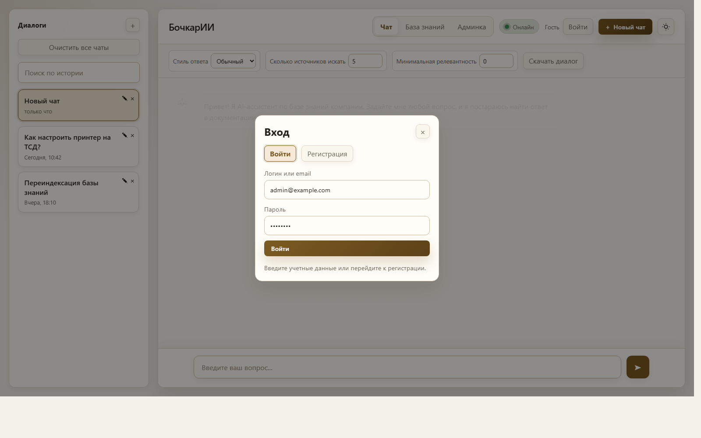
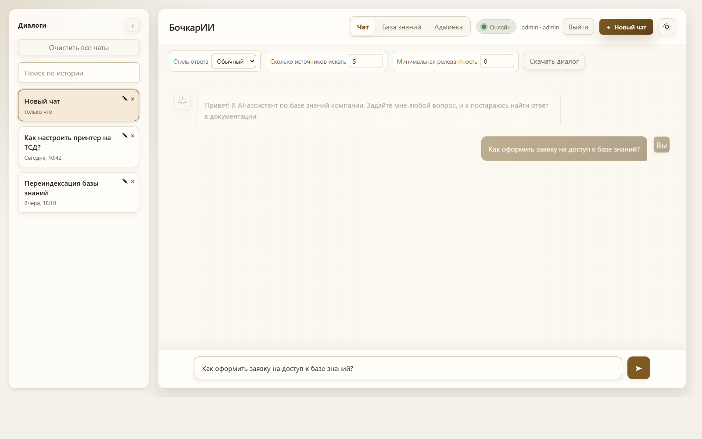
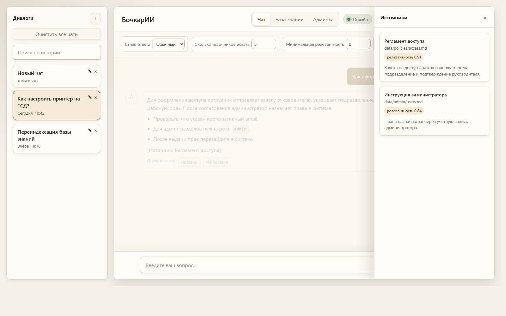
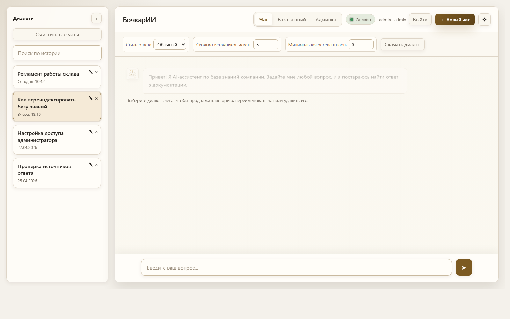
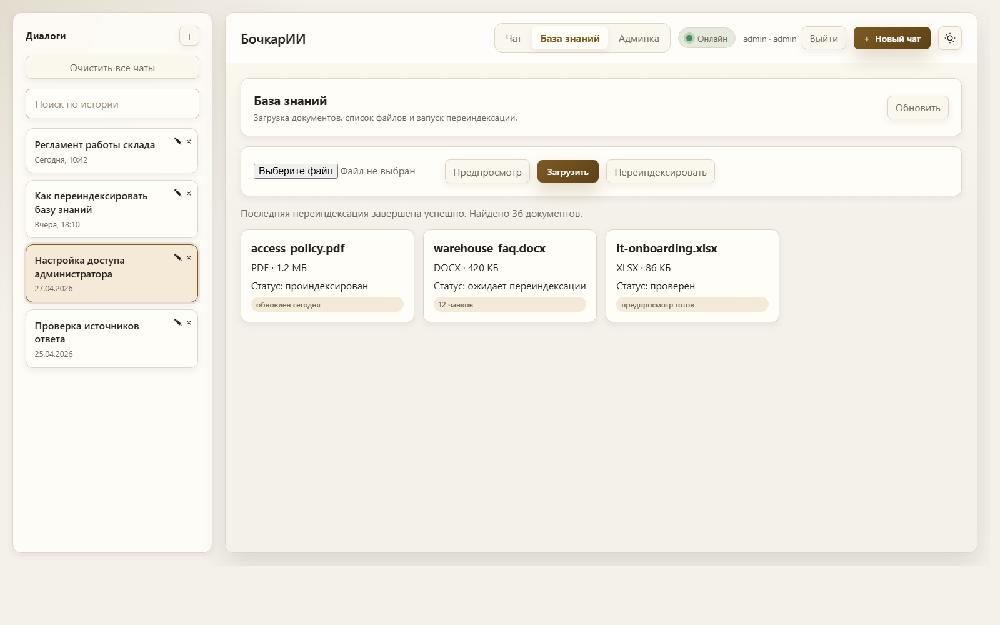
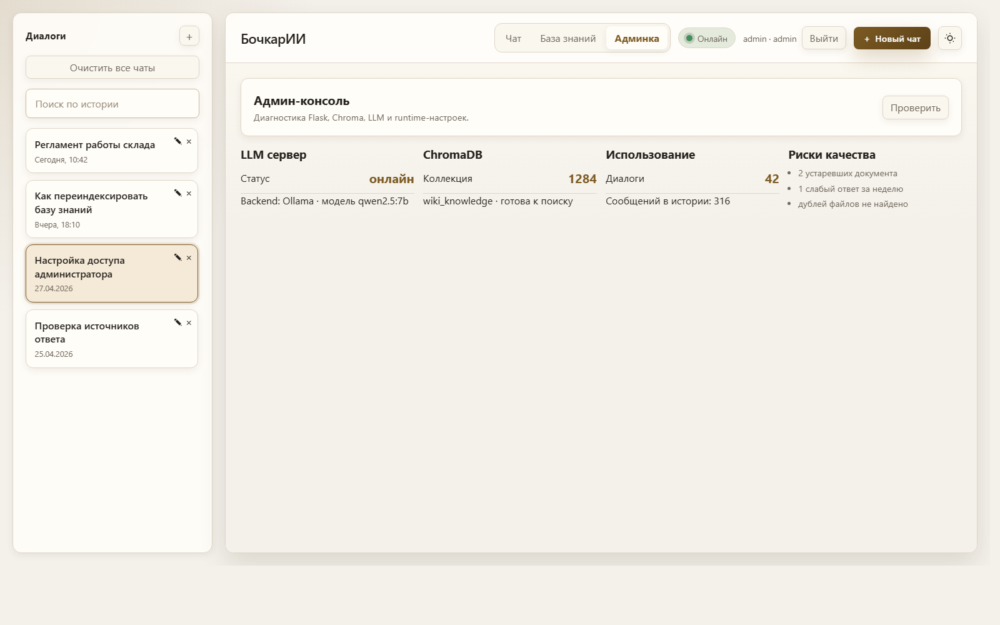

# Пользовательская инструкция

Документ для сотрудников, которые работают с системой через веб-интерфейс.

## Скриншоты интерфейса

В инструкции используются скриншоты из папки `docs/images/`:

- `01-login.png`
- `02-new-chat.png`
- `03-answer-sources.png`
- `04-chat-list.png`
- `05-documents-admin.png`
- `06-admin-overview.png`

## 1. Вход в систему

1. Откройте в браузере: `http://localhost:5000`.
2. Если у вас есть учетная запись, выполните вход.
3. Если учетной записи нет, нажмите регистрацию (или обратитесь к администратору).

## 2. Быстрый старт

1. Нажмите **«Новый чат»**.
2. Введите вопрос в поле сообщения.
3. Дождитесь ответа и проверьте блок **источников** под ответом.
4. При необходимости задайте уточняющий вопрос в том же чате.

Рекомендуется формулировать вопрос конкретно: указывать название процесса, документа, подразделения или системы.

## 3. Работа с ответом

После каждого ответа доступны:

- список источников, по которым сформирован ответ;
- цитаты из документов;
- уточняющие вопросы для продолжения темы;
- оценка качества ответа (**«Полезно / Не полезно»**).

Если ответ неточный:

1. уточните вопрос более предметно;
2. уменьшите/увеличьте строгость отбора источников (если опция доступна в интерфейсе);
3. проверьте, есть ли нужный документ в базе знаний.

## 4. Работа с чатами

В интерфейсе можно:

- создавать новые чаты;
- переименовывать чаты;
- удалять один чат или очистить историю;
- возвращаться к предыдущим диалогам.

История чатов сохраняется автоматически.

## 5. Рекомендации по формулировке запросов

Хороший запрос:

- содержит контекст (что именно нужно сделать);
- содержит ограничения (для какой роли, в какой системе);
- не слишком общий.

Примеры:

- `Как настроить принтер на ТСД для сотрудника склада?`
- `Какие шаги нужны для переиндексации базы знаний?`

## 6. Загрузка и обновление документов (для администратора)

Раздел управления базой знаний доступен пользователям с ролью `admin`.

Возможности:

- загрузка нового документа;
- предпросмотр изменений перед сохранением;
- запуск переиндексации базы знаний;
- просмотр статуса задач индексации.

Рекомендуемый порядок:

1. загрузить файл;
2. проверить предпросмотр;
3. запустить переиндексацию;
4. проверить ответы на контрольные вопросы.

## 7. Админ-диагностика (для администратора)

В админ-разделе можно проверить:

- доступность сервера LLM;
- состояние ChromaDB;
- активные модели;
- настройки RAG;
- риски качества базы знаний (устаревшие документы, дубли, слабые ответы).

## 8. Частые проблемы

**Пустой или слабый ответ**
- Переформулируйте вопрос точнее.
- Проверьте, что нужный документ действительно есть в базе.
- При необходимости обратитесь к администратору для актуализации базы.

**Нет доступа к разделу документов/админке**
- Проверьте, что вы вошли под учетной записью с ролью `admin`.

**Система отвечает ошибкой**
- Повторите запрос позже.
- Если ошибка повторяется, передайте администратору время ошибки и текст запроса.

## 9. Короткий чек-лист пользователя

- Я вошел в нужную учетную запись.
- Задаю конкретные вопросы.
- Проверяю источники и цитаты.
- Оцениваю качество ответа.
- Сообщаю администратору о системных ошибках.

