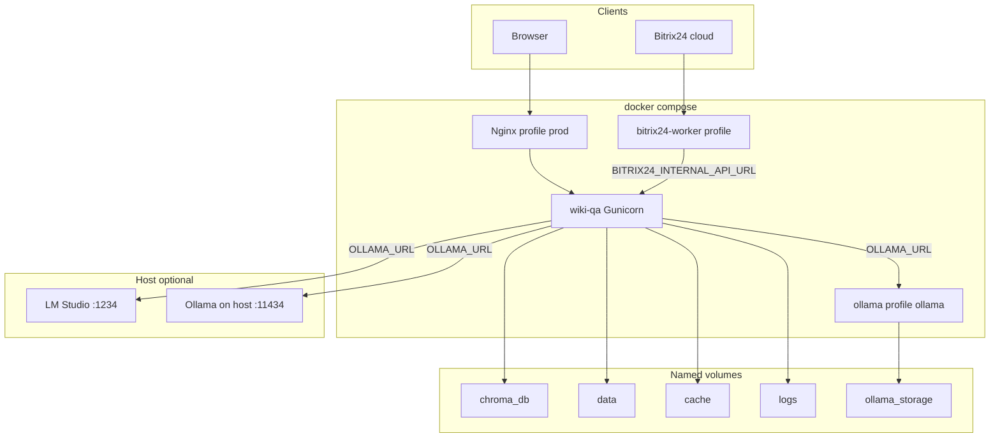

# План контейнеризации Wiki QA System

Дата: 2026-06-04  
Статус: план к реализации (код не менялся)  
Охват: Windows (Docker Desktop) и Linux (продакшен); профили compose под Ollama в Docker, Ollama/LM Studio на хосте.

## Краткое описание

Развернуть Wiki QA System в Docker как многосервисный стек: приложение (Gunicorn), опционально Ollama / Nginx / Bitrix worker, с постоянными томами для Chroma, SQLite и данных.

## Чеклист реализации

- [ ] Создать `Dockerfile` (python:3.12-slim, lxml deps, gunicorn, non-root) и `.dockerignore`
- [ ] Расширить `docker-compose.yml`: wiki-qa, volumes, env, healthcheck, profiles ollama/prod/bitrix
- [ ] Добавить `docker/entrypoint.sh` и `docker/nginx/wiki-qa.conf` (SSE, timeouts, body size)
- [ ] Дополнить `.env.example` и написать `docs/docker.md` (профили, GPU, LM Studio, миграция с XAMPP)
- [ ] Smoke-тест: health, chat, stream, persistence volumes; документировать `ollama pull` моделей

## Текущее состояние

| Компонент | Где живёт сейчас | Отдельный контейнер? |
|-----------|------------------|----------------------|
| Flask API + UI | `web_app.py` | **Да** — основной сервис `wiki-qa` |
| ChromaDB | Локальный каталог `CHROMA_PERSIST_DIR` (`chromadb.PersistentClient`) | **Нет** — встроенная БД в volume |
| SQLite (пользователи, чаты) | `DATABASE_PATH` → `data/wiki_qa.db` | **Нет** — файл в volume `data` |
| Кэш эмбеддингов | `cache/` | **Нет** — volume |
| LLM (Ollama / LM Studio) | Внешний HTTP | **Ollama — да** (уже `docker-compose.yml`); LM Studio — на хосте |
| Cross-encoder rerank | `sentence-transformers` в процессе app | **Нет** (опционально volume `HF_HOME`) |
| Bitrix24 polling | `scripts/bitrix24_bot_worker.py` | **Опционально** — второй контейнер с тем же образом |



## Целевая топология сервисов

Рекомендуемый минимум для **полноценной работы**:

1. **`wiki-qa`** — Gunicorn, `web_app:app`, порт `5000`
2. **`ollama`** (профиль `ollama`) — или внешний URL без этого сервиса

Опционально:

3. **`nginx`** (профиль `prod`) — TLS, `client_max_body_size`, SSE для `/api/chat/stream`
4. **`bitrix24-worker`** (профиль `bitrix`) — тот же image, `command: python scripts/bitrix24_bot_worker.py`

**Не выносить** в отдельные контейнеры: Chroma, SQLite, BM25 pickle (`bm25_corpus.pkl` в `chroma_db/`) — приложение ожидает локальные пути из `config/settings.py`.

## Файлы, которые нужно добавить

| Файл | Назначение |
|------|------------|
| `Dockerfile` | Образ приложения (Python 3.12-slim, системные deps для `lxml`, non-root user) |
| `.dockerignore` | Исключить `venv`, `__pycache__`, `.env`, локальные `chroma_db/`, `cache/`, `logs/`, `data/` (данные — только через volumes) |
| `docker-compose.yml` | Расширить: `wiki-qa`, profiles, volumes, healthcheck, depends_on |
| `docker-compose.override.example.yml` | Примеры GPU, LM Studio, bind-mount существующих данных с XAMPP |
| `docker/entrypoint.sh` | `mkdir` при старте, опционально `settings.validate()`, exec gunicorn |
| `docker/nginx/wiki-qa.conf` | Прокси + SSE (`proxy_buffering off`, long `proxy_read_timeout`) |
| `requirements-docker.txt` или строка в Dockerfile | `gunicorn` (сейчас только в `docs/production_setup.md`, не в `requirements.txt`) |
| `docs/docker.md` | Запуск, профили, миграция с текущей установки, pull моделей Ollama |

Обновить: `.env.example` — блок «Docker» с URL `http://ollama:11434`, `http://wiki-qa:5000` для Bitrix worker; `README.md` — ссылка на `docs/docker.md`.

## Dockerfile (ключевые решения)

**Базовый образ:** `python:3.12-slim-bookworm`

**Системные пакеты:** `gcc`, `libxml2-dev`, `libxslt1-dev` (для `lxml` / парсинга документов в `create_vector_db.py` и uploads).

**Установка Python:** `pip install -r requirements.txt` + `gunicorn`.

**Пользователь:** `appuser` (uid 1000), `WORKDIR /app`, копировать только код проекта (без `chroma_db`, `data` из хоста).

**Команда по умолчанию** (как в production systemd):

```bash
gunicorn --bind 0.0.0.0:5000 \
  --workers 1 \
  --threads 4 \
  --timeout 300 \
  --access-logfile - \
  --error-logfile - \
  web_app:app
```

`--workers 1` предпочтительнее для старта: глобальный singleton `RAGSystem` / BM25-корпус в памяти на процесс (`CODE_AUDIT.md`); при росте нагрузки — увеличивать `threads`, не workers, пока не решена многопроцессная инициализация.

**HEALTHCHECK:** `GET http://127.0.0.1:5000/api/health` (ожидать `database: true`; `ollama` может быть false на старте — это нормально до pull моделей).

**Размер образа:** `sentence-transformers` тянет PyTorch. Для образа по умолчанию оставить `RERANK_ENABLED=false`; при включении rerank — volume `HF_HOME=/app/.cache/huggingface` и документировать +2–4 GB RAM.

## docker-compose.yml — структура и профили

### Сервис `wiki-qa`

```yaml
services:
  wiki-qa:
    build: .
    env_file: .env
    ports: ["5000:5000"]   # dev; в prod — только expose, публикация через nginx
    volumes:
      - chroma_data:/app/chroma_db
      - app_data:/app/data
      - app_cache:/app/cache
      - app_logs:/app/logs
    environment:
      CHROMA_PERSIST_DIR: /app/chroma_db
      DATA_DIR: /app/data
      DATABASE_PATH: /app/data/wiki_qa.db
      CACHE_DIR: /app/cache
      LOG_DIR: /app/logs
      CHAT_ATTACHMENTS_DIR: /app/data/chat_attachments
      FLASK_DEBUG: "false"
    depends_on:
      ollama:
        condition: service_started
        required: false   # compose v2.24+ optional dependency via profiles
    healthcheck: ...
    restart: unless-stopped
```

Использовать **profiles**, чтобы `depends_on: ollama` не ломал запуск без Ollama:

- `profiles: ["default", "ollama"]` для `wiki-qa` в варианте «всё в compose»
- Отдельный файл `docker-compose.lmstudio.yml` / переменные: `OLLAMA_URL=http://host.docker.internal:1234` (Windows/macOS) или `http://172.17.0.1:1234` (Linux extra_hosts)

### Сервис `ollama` (профиль `ollama`)

Расширить существующий блок в `docker-compose.yml`:

- volume `ollama_storage` (уже есть)
- **profile:** `ollama`
- **GPU (Linux / WSL2):** `deploy.resources.reservations.devices` (см. `GPU_SETUP.md`)
- `OLLAMA_URL=http://ollama:11434` в `.env` для `wiki-qa`

### Сервис `nginx` (профиль `prod`)

- Публикует `80:80`, `443:443`
- `proxy_pass http://wiki-qa:5000`
- Для SSE `/api/chat/stream`: `proxy_http_version 1.1`, `proxy_buffering off`, `proxy_read_timeout 600s`, `chunked_transfer_encoding on`
- `client_max_body_size` ≥ `MAX_FILE_SIZE` (10M по умолчанию)

### Сервис `bitrix24-worker` (профиль `bitrix`)

- `image` / `build` тот же, что `wiki-qa`
- `command: ["python", "scripts/bitrix24_bot_worker.py"]`
- `environment`:
  - `BITRIX24_INTERNAL_API_URL=http://wiki-qa:5000`
  - те же volumes `app_data` (offset `bitrix24_event_offset.json`)
- без публикации портов наружу

### One-off задачи (не долгоживущие сервисы)

```bash
# Индексация (нужен доступный inference + data/wiki_pars в volume)
docker compose run --rm wiki-qa python create_vector_db.py

# Админ
docker compose run --rm wiki-qa python scripts/create_admin.py --username admin ...
```

## Переменные окружения для Docker

Критичные переопределения относительно локального `.env`:

| Переменная | Локально (XAMPP) | В compose |
|------------|------------------|-----------|
| `OLLAMA_URL` | `http://localhost:11434` | `http://ollama:11434` (профиль ollama) или `http://host.docker.internal:1234` (LM Studio) |
| `BITRIX24_INTERNAL_API_URL` | `http://127.0.0.1:5000` | `http://wiki-qa:5000` |
| Пути данных | `./chroma_db`, `./data` | `/app/chroma_db`, `/app/data` (через env выше) |
| `SECRET_KEY`, `JWT_SECRET_KEY` | placeholder | **обязательно** сгенерировать перед prod |

`INFERENCE_BACKEND` / `EMBEDDING_API_MODE` / `CHAT_API_MODE` — без изменений логики; только URL хоста меняется.

## Миграция с текущей установки (c:\xampp\htdocs\wiki_4)

`chroma_db/` и `data/` в `.gitignore` — в образ не попадут. Для сохранения уже собранной базы:

**Вариант A — named volumes (чистый Docker):**

```powershell
docker volume create wiki4_chroma_data
docker run --rm -v wiki4_chroma_data:/target -v C:/xampp/htdocs/wiki_4/chroma_db:/source alpine cp -a /source/. /target/
# аналогично для data/, cache/ при необходимости
```

**Вариант B — bind-mount (удобно на Windows dev):** в `docker-compose.override.yml`:

```yaml
volumes:
  - C:/xampp/htdocs/wiki_4/chroma_db:/app/chroma_db
  - C:/xampp/htdocs/wiki_4/data:/app/data
```

После первого запуска проверить: `curl http://localhost:5000/api/health` → `database: true`, `ollama: true` (когда inference доступен).

## Профили compose

| Команда | Состав | Inference |
|---------|--------|-----------|
| `docker compose --profile ollama up -d` | wiki-qa + ollama | Ollama в Docker |
| `docker compose up -d wiki-qa` + `.env` `OLLAMA_URL=http://host.docker.internal:11434` | только wiki-qa | Ollama на хосте |
| `OLLAMA_URL=http://host.docker.internal:1234`, `INFERENCE_BACKEND=lmstudio` | только wiki-qa | LM Studio на хосте |
| `--profile prod` | + nginx | любой из выше |
| `--profile bitrix` | + bitrix24-worker | `BITRIX24_ENABLED=true` |

**Первый запуск Ollama в Docker** (не автоматизировать в entrypoint — долго и требует сети):

```bash
docker compose exec ollama ollama pull bge-m3
docker compose exec ollama ollama pull qwen2.5:7b
```

Размерность эмбеддингов должна совпадать с уже собранной Chroma (`README.md`).

## Windows (Docker Desktop) vs Linux (prod)

| Тема | Windows dev | Linux prod |
|------|-------------|------------|
| LM Studio / Ollama на хосте | `host.docker.internal` | `extra_hosts: host.docker.internal:host-gateway` или IP хоста |
| GPU для Ollama | WSL2 + NVIDIA Container Toolkit + Docker Desktop GPU | `deploy.resources` nvidia |
| Публикация | `ports: 5000:5000` напрямую | профиль `prod` + nginx + Let's Encrypt (certbot на хосте или отдельный контейнер) |
| Файловые права | bind-mount с NTFS обычно без проблем | named volumes + `chown` при копировании данных |
| Логи | volume `app_logs` или `docker compose logs -f wiki-qa` | то же + ротация на хосте |

Systemd из `docs/production_setup.md` заменяется политикой `restart: unless-stopped` в compose; при желании оставить systemd только для `docker compose up` как wrapper.

## Порядок внедрения (пошагово)

1. **Dockerfile + .dockerignore** — собрать образ, `docker build -t wiki-qa:local .`
2. **Расширить docker-compose.yml** — сервис `wiki-qa`, volumes, env, healthcheck
3. **Профили `ollama`, `prod`, `bitrix`** + example override для GPU и bind-mount
4. **docker/entrypoint.sh** + gunicorn в зависимостях
5. **nginx conf** для SSE и upload size
6. **docs/docker.md** — сценарии запуска, health, pull моделей, миграция данных с XAMPP
7. **Smoke-тест:**
   - `GET /api/health`
   - `POST /api/chat` с тестовым вопросом
   - `POST /api/chat/stream` (проверка через браузер за nginx)
   - опционально: upload + `attachment_ids` если включены vision-модели
8. **CI (опционально):** `docker build` в pipeline без push тяжёлых volumes

## Риски и ограничения

- **Пустая Chroma в новом volume** — приложение стартует, но RAG не отвечает по базе; нужен `create_vector_db.py` или копирование `chroma_db`.
- **LM Studio в контейнере** — нецелесообразно (GUI); только хост или отдельная VM.
- **Vision-вложения** — требуют `CHAT_API_MODE=openai` и vision-модель на inference-сервере; Docker на это не влияет, только `.env`.
- **Долгие запросы** — gunicorn `--timeout 300`; nginx `proxy_read_timeout` не меньше.
- **Многопроцессный gunicorn** — дублирование памяти BM25/rerank; начинать с 1 worker.
- **Секреты** — `.env` монтировать через `env_file`, не bake в образ; в prod генерировать `SECRET_KEY` / `JWT_SECRET_KEY`.

## Критерий готовности

Система считается «полноценно в Docker», когда без Python на хосте:

- UI открывается (напрямую `:5000` или через nginx),
- `/api/health` показывает доступный inference и ненулевую Chroma,
- чат и stream-чат возвращают ответы с цитатами,
- загрузка документов / вложений пишет в persistent volume,
- после `docker compose down` + `up` данные и индекс сохраняются.
