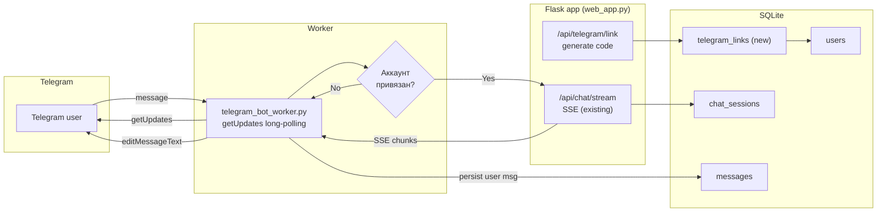

# План: Telegram-бот для RAG-системы «БочкарИИ»

## Обзор

Добавить Telegram-бота как новый канал доступа к RAG-системе. Архитектура — **long-polling воркер** по аналогии с Bitrix24 ([`scripts/bitrix24_bot_worker.py`](../scripts/bitrix24_bot_worker.py) + [`integrations/bitrix24.py`](../integrations/bitrix24.py)), с **привязкой аккаунта wiki_4** через одноразовый код, командами `/start`, `/help`, `/reset`, `/mode`, `/history` и **стримингом ответа** (редактирование сообщения по мере генерации). Полная реализация: backend + воркер + тесты. UI веб-интерфейса не затрагивается (кроме страницы генерации кода привязки).

## Архитектура



## Поток привязки аккаунта (link_account)

1. Пользователь логинится в веб-UI (существующий `/api/auth/login`).
2. Открывает страницу/модал «Привязать Telegram» → `POST /api/telegram/link` → сервер генерирует `code` (6 цифр, TTL 10 мин), сохраняет в новой таблице `telegram_links` с `user_id`, `code`, `expires_at`, `used_at=NULL`.
3. Пользователь пишет боту в Telegram: `/start <code>`.
4. Воркер вызывает `getMe`/`getUpdates`, видит команду `/start <code>`, дергает `POST /api/telegram/verify` с `code` и `telegram_user_id` → сервер находит запись, помечает `used_at=now`, `telegram_user_id=...`, возвращает `user_id` и `role`.
5. Воркер кеширует маппинг `telegram_user_id → user_id` в памяти (с TTL/refetch). Дальнейшие вопросы идут от имени этого `user_id`.

## Этапы реализации

### Шаг 1. Настройки окружения (`config/settings.py` + `.env.example`)

По аналогии с Bitrix24-блоком ([`config/settings.py:205-217`](../config/settings.py)) добавить поля:

- `TELEGRAM_ENABLED: bool` (default `false`)
- `TELEGRAM_BOT_TOKEN: str` (default `""`)
- `TELEGRAM_POLL_INTERVAL_SECONDS: int` (default `2`, getUpdates long-polling timeout=30 на стороне API)
- `TELEGRAM_OFFSET_PATH: str` (default `./data/telegram_update_offset.json`)
- `TELEGRAM_INTERNAL_API_URL: str` (default `http://127.0.0.1:{API_PORT}`)
- `TELEGRAM_INTERNAL_API_KEY: str` (default `API_KEY`)
- `TELEGRAM_LINK_CODE_TTL_SECONDS: int` (default `600`)
- `TELEGRAM_STREAM_EDIT_INTERVAL_MS: int` (default `800` — минимальный интервал editMessageText для соблюдения rate-limit ~1/sec/msg)
- `TELEGRAM_MAX_MESSAGE_LENGTH: int` (default `4096` — лимит Telegram)

В `.env.example` добавить закомментированный блок `# Telegram bot integration` после блока Bitrix24 ([`.env.example:95-111`](../.env.example)).
В `config/settings.py:265` добавить `Path(self.TELEGRAM_OFFSET_PATH).parent.mkdir(...)` рядом с Bitrix24.

### Шаг 2. Интеграционный модуль `integrations/telegram.py`

По аналогии с [`integrations/bitrix24.py`](../integrations/bitrix24.py) — `TelegramClient` (dataclass) + `TelegramError`:

```python
@dataclass
class TelegramClient:
    bot_token: str
    base_url: str = "https://api.telegram.org"
    timeout: float = 35.0  # long-polling

    def get_updates(self, offset: int | None, limit: int = 100, timeout: int = 30) -> list[dict]
    def send_message(self, chat_id: int, text: str, parse_mode: str = "HTML") -> dict
    def edit_message_text(self, chat_id: int, message_id: int, text: str, parse_mode: str = "HTML") -> dict
    def send_chat_action(self, chat_id: int, action: str = "typing") -> dict  # для индикатора "печатает"
```

Все вызовы — `requests.get/post` к `https://api.telegram.org/bot<token>/<method>`. Обработка `429 Too Many Requests` с `retry_after`. HTML-экранирование ответов LLM: `<>&`, обрезка по `TELEGRAM_MAX_MESSAGE_LENGTH` с разумным разделителем.

### Шаг 3. Таблица привязки аккаунтов в SQLite (`core/chat_history.py`)

Добавить в `_create_tables` ([`core/chat_history.py:41`](../core/chat_history.py)) новую таблицу:

```sql
CREATE TABLE IF NOT EXISTS telegram_links (
    id INTEGER PRIMARY KEY AUTOINCREMENT,
    user_id INTEGER NOT NULL,
    code TEXT NOT NULL UNIQUE,
    telegram_user_id INTEGER,
    telegram_username TEXT,
    created_at TEXT NOT NULL,
    expires_at TEXT NOT NULL,
    used_at TEXT,
    FOREIGN KEY (user_id) REFERENCES users (id) ON DELETE CASCADE
);
CREATE INDEX IF NOT EXISTS idx_telegram_links_code ON telegram_links(code);
CREATE INDEX IF NOT EXISTS idx_telegram_links_tg_user ON telegram_links(telegram_user_id);
```

Добавить методы в `ChatHistoryManager`:
- `create_telegram_link(user_id) -> dict` — генерация 6-значного кода, TTL 10 мин, не более 1 активного кода на пользователя (инвалидация старых).
- `verify_telegram_link(code, telegram_user_id, telegram_username) -> dict | None` — проверка кода, установка `used_at`, возврат `{user_id, role}` или `None`.
- `get_telegram_link(telegram_user_id) -> dict | None` — получение существующей привязки для кеша воркера.

### Шаг 4. API-эндпоинты привязки (`api/routes/telegram.py`)

Новый blueprint `telegram_bp`, prefix `/api/telegram`. Регистрация в [`web_app.py:235-240`](../web_app.py) рядом с другими blueprints.

- `POST /api/telegram/link` — авторизованный (через `current_user_id()`) пользователь запрашивает код. Возвращает `{code, expires_at, bot_username?}`. Если `TELEGRAM_ENABLED=false` — 400.
- `POST /api/telegram/verify` — внутренний, вызывается воркером. Принимает `code`, `telegram_user_id`, `telegram_username`. Заголовок `X-API-Key` обязателен (проверка через существующий `before_request` в [`web_app.py`](../web_app.py)). Возвращает `{user_id, role}` или 404.
- `GET /api/telegram/status` — публичный (как `/api/issues/status`), возвращает `{enabled, bot_username}` для UI.

### Шаг 5. Воркер `scripts/telegram_bot_worker.py`

Структура зеркальна [`scripts/bitrix24_bot_worker.py`](../scripts/bitrix24_bot_worker.py) (204 строки):

- `load_offset` / `save_offset` — аналогично Bitrix24 (см. [`bitrix24_bot_worker.py:40-60`](../scripts/bitrix24_bot_worker.py)).
- `TelegramSession` — in-memory состояние на `telegram_user_id`: `{user_id, chat_id (wiki_4 session), answer_mode}`.
- `parse_command(text) -> (cmd, args)` — выделение `/start <code>`, `/reset`, `/mode <name>`, `/history`, `/help`.
- `handle_start(code, tg_user) -> str` — вызов `/api/telegram/verify`.
- `handle_reset(session)` — очистка `chat_id` в `TelegramSession` (новый диалог начнётся со следующего вопроса).
- `handle_mode(mode)` — валидация режима из списка `["обычный","кратко","подробно","по_источникам","по_шагам","инструкция"]` (соответствует 6 режимам в [`templates/index.html:118-125`](../templates/index.html)).
- `handle_question(update, session)` — основной поток:
  1. `send_chat_action(typing)` — индикатор «печатает» (обновлять каждые 5 сек).
  2. Отправить плейсхолдер `send_message(chat_id, "⏳ Думаю...")` → получить `message_id`.
  3. Вызвать внутренний `POST /api/chat/stream` с заголовком `X-API-Key`, body `{message, chat_id, answer_mode, telegram_user_id}`.
     - **Модификация `/api/chat/stream`**: добавить опциональные поля `telegram_user_id` / `user_id_override` в `_resolve_chat_session` ([`web_app.py:158`](../web_app.py)) — если передан `telegram_user_id` и найдена привязка, создавать/продолжать сессию от имени этого `user_id`. Это ключевой момент интеграции: чаты из Telegram попадают в общую историю и видны в веб-UI пользователя.
  4. Читать SSE-поток (как в [`static/script.js:1721`](../static/script.js) `readStream`), аккумулировать текст ответа + sources.
  5. Каждые `TELEGRAM_STREAM_EDIT_INTERVAL_MS` (800 мс) вызывать `edit_message_text` с накопленным текстом. Соблюдать rate-limit: не чаще 1 edit/sec/msg.
  6. По завершении потока: финальный edit с полным ответом + отдельное сообщение со списком источников (`📄 Источники:\n1. ...`).
- `process_update(update)` — диспетчер: текст с `/` → команда, иначе → вопрос.
- `run_once(client, offset)` → `(next_offset, processed)`.
- `main()` — CLI с `--once`, `--limit` (как в Bitrix24).

### Шаг 6. Модификация `/api/chat/stream` для Telegram-идентификации

В [`web_app.py:158`](../web_app.py) `_resolve_chat_session` добавить ветку:
```python
tg_user_id = _int_or_none(data.get("telegram_user_id"))
if tg_user_id is not None and not current_user_id():
    link = chat_history.get_telegram_link(tg_user_id)
    if link and link["user_id"]:
        # Создаём/продолжаем сессию от имени привязанного пользователя
        ...
```
Это позволит чатам из Telegram корректно сохраняться в истории пользователя и учитываться в админке/аналитике.

### Шаг 7. Тесты (`tests/test_telegram_integration.py`)

По образцу [`tests/test_bitrix24_integration.py`](../tests/test_bitrix24_integration.py) (97 строк):

- `test_telegram_client_get_updates` — мок `requests`, проверка URL/payload.
- `test_telegram_client_send_message` — мок, проверка `parse_mode=HTML`.
- `test_offset_roundtrip` — `load_offset`/`save_offset` (как в Bitrix24-тесте).
- `test_parse_command_start` — `/start 123456` → `("start", "123456")`.
- `test_parse_command_mode` — `/mode кратко` → `("mode", "кратко")`.
- `test_handle_question_streams_and_edits` — мок `requests.post` для `/api/chat/stream` (возвращает SSE-чанки), мок `TelegramClient`, проверка последовательности `send_message` → N × `edit_message_text` → финальный `edit_message_text` + `send_message` (источники).
- `test_handle_start_verification` — мок `/api/telegram/verify`, проверка заполнения `TelegramSession`.
- `test_handle_reset_clears_session` — после reset следующий вопрос создаёт новый `chat_id`.
- `test_telegram_link_code_generation` — через `ChatHistoryManager` с временной БД: `create_telegram_link` → `verify_telegram_link` → `get_telegram_link`.
- `test_resolve_chat_session_with_telegram_user_id` — на Flask test client: привязка создаётся, запрос к `/api/chat/stream` с `telegram_user_id` создаёт сессию с правильным `user_id`.

Дополнительно обновить `tests/test_scripts_smoke.py`, если он импортирует все скрипты (чтобы новый воркер проходил smoke-проверку).

### Шаг 8. Документация

- `docs/telegram_bot_setup.md` (новый) — по образцу `docs/bitrix24_bot_setup.md` (если существует) / `docs/github_issues_setup.md`: получение токена у `@BotFather`, настройка `.env`, запуск воркера, инструкция привязки аккаунта пользователем.
- В `README.md` добавить секцию про Telegram-бота рядом с Bitrix24.
- В `start.bat` (если он запускает Bitrix24-воркер) добавить опциональный запуск Telegram-воркера.

## Файлы (изменения и новые)

**Новые:**
- [`integrations/telegram.py`](../integrations/telegram.py) — клиент Telegram Bot API
- [`api/routes/telegram.py`](../api/routes/telegram.py) — blueprint привязки
- [`scripts/telegram_bot_worker.py`](../scripts/telegram_bot_worker.py) — long-polling воркер
- [`tests/test_telegram_integration.py`](../tests/test_telegram_integration.py) — тесты
- [`docs/telegram_bot_setup.md`](../docs/telegram_bot_setup.md) — документация

**Изменяемые:**
- [`config/settings.py`](../config/settings.py) — новые настройки (блок после Bitrix24)
- [`.env.example`](../.env.example) — закомментированный блок Telegram
- [`core/chat_history.py`](../core/chat_history.py) — таблица `telegram_links` + 3 метода
- [`web_app.py`](../web_app.py) — регистрация `telegram_bp`, модификация `_resolve_chat_session` для `telegram_user_id`
- [`tests/test_scripts_smoke.py`](../tests/test_scripts_smoke.py) — добавить импорт нового воркера
- [`README.md`](../README.md) — секция про Telegram-бота
- [`start.bat`](../start.bat) — опциональный запуск Telegram-воркера

## Зависимости

`requests` уже в `requirements.txt` (используется Bitrix24-клиентом и воркером). Новых зависимостей нет — используем прямой REST-вызов Telegram Bot API, без библиотеки `python-telegram-bot`.

## Критерии готовности

1. `python scripts/telegram_bot_worker.py --once` отрабатывает без ошибок при `TELEGRAM_ENABLED=true`.
2. `pytest tests/test_telegram_integration.py` — все тесты зелёные.
3. Веб-пользователь может запросить код привязки, отправить `/start <code>` боту, получить подтверждение.
4. Вопрос боту → стриминг-ответ с источниками, диалог сохраняется в истории пользователя (виден в веб-UI).
5. Команды `/reset`, `/mode`, `/history`, `/help` работают.
6. Чаты из Telegram учитываются в админке (overview/аналитика) как обычные чаты привязанного пользователя.

## Риски и решения

- **Telegram rate-limit на editMessageText**: 1 edit/sec на сообщение. Решение: `TELEGRAM_STREAM_EDIT_INTERVAL_MS=800` + только если текст изменился.
- **Длина сообщения 4096 символов**: длинные ответы LLM. Решение: обрезка + отдельное сообщение «... (ответ обрезан, полный текст в веб-версии)».
- **Конкурентные запросы от одного Telegram-пользователя**: один воркер обрабатывает updates последовательно, но для нескольких юзеров — параллельно через ThreadPoolExecutor (опционально, можно начать с последовательной обработки).
- **Секреты в коде**: токен бота только в `.env`, не логировать. В логах — только `telegram_user_id` и `update_id`.

## Задачи (todos)

- [ ] Настройки `TELEGRAM_*` в `config/settings.py` и `.env.example`
- [ ] `integrations/telegram.py` — клиент Telegram Bot API
- [ ] Таблица `telegram_links` и методы в `core/chat_history.py`
- [ ] `api/routes/telegram.py` — эндпоинты link/verify/status
- [ ] `scripts/telegram_bot_worker.py` — long-polling воркер со стримингом
- [ ] Модификация `_resolve_chat_session` в `web_app.py` для `telegram_user_id`
- [ ] `tests/test_telegram_integration.py`
- [ ] `docs/telegram_bot_setup.md` и обновление `README.md`
