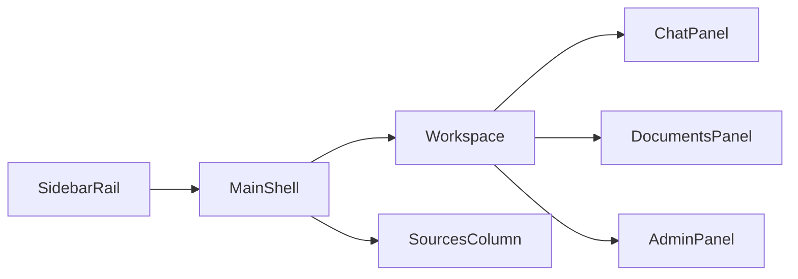

# Option D — подробный план реализации

> Для реализации выполнять задачи по порядку. Никаких изменений production UI до появления падающего теста для соответствующего контракта. Прототип — источник визуальных решений, а не код для копирования: [`design-prototypes/option-d-diadoc-tile-workspace.html`](../../design-prototypes/option-d-diadoc-tile-workspace.html).

## Цель

Перенести утверждённую Option D в Flask SPA БочкарИИ: фирменная золотисто-графитовая система, двухуровневая shell-grid, рабочий чат в центре, постоянные источники на desktop и компактный sidebar rail — без регрессии RAG, streaming, ролей, вложений и админки.

## Техническая архитектура



### Каноническая компоновка

```text
.app-container
├── aside.workspace-sidebar
│   ├── brand
│   ├── #sidebarNewChatBtn
│   ├── #chatSearchInput
│   ├── #chatList
│   └── #clearChatsBtn
└── .main-shell
    ├── main.chat-container
    │   ├── top row: title + health/auth/actions
    │   ├── .workspace-tabs
    │   ├── #chatPanel
    │   ├── #documentsPanel
    │   └── #adminPanel
    └── #sourcesPanel
        ├── #closeSources
        └── #sourcesList
```

- Outer grid: `250px minmax(0, 1fr)`.
- Inner grid: `minmax(0, 1fr) 294px`.
- `>=981px`: sidebar and sources are visible.
- `621–980px`: sources are an overlay/drawer opened by source buttons; sidebar stays fixed.
- `<=620px`: sidebar becomes a keyboard-accessible drawer/toggle; workspace is full width; sources remain a full-width drawer fallback.

## Визуальный контракт

| Role | Value | Use |
|---|---:|---|
| Brand gold | `#A88656` | primary CTA, active underline, metadata |
| Brand sand | `#D6BC8A` | soft brand field, answer metadata |
| Graphite | `#212529` | primary text, answer-card background |
| Workspace canvas | `#F4F5F6` | neutral work background |
| Line | `#DDE1E5` | separators, control borders |
| Muted | `#68717B` | secondary labels |
| Mint | `#D9F2EB` | secondary tile/icon emphasis only |

- Compact controls and history cards: `12–14px` radius; CTA pills only for small actions.
- The active sidebar item uses full-field fill/border, not a thick colored side stripe.
- Tabs are underline navigation, not pill tabs.
- User messages are neutral. Assistant answers are dark graphitic panels while preserving normal markdown semantics.
- Sources are compact cards, not a generic dashboard. The selected source changes full card state and connected citation state.
- Tiles only appear in a truly empty/new chat state. Documents, settings and admin cards remain data-dense.

## Production file map

| File | Responsibility | Required change |
|---|---|---|
| [`templates/index.html`](../../templates/index.html) | DOM shell and panel IDs | Build `main-shell`; keep every existing ID/hook |
| [`static/css/theme.css`](../../static/css/theme.css) | light/dark tokens | Add Option D semantic token pairs |
| [`static/style.css`](../../static/style.css) | shell, sidebar, chat, sources, responsive | Consolidate duplicate/competing layout blocks |
| [`static/css/components.css`](../../static/css/components.css) | controls, tabs, toolbar, composer | Apply Option D component geometry |
| [`static/css/markdown.css`](../../static/css/markdown.css) | answer typography | Ensure markdown/table/code readability in dark answer panel |
| [`static/script.js`](../../static/script.js) | all interactions | Minimal changes for empty state and adaptive source state |
| [`static/js/theme.js`](../../static/js/theme.js) | `data-theme` toggle | Preserve behavior |
| [`static/js/clipboard.js`](../../static/js/clipboard.js) | copy observer | Keep `.message-content` on copyable bot content |
| [`scripts/capture_screenshots.py`](../../scripts/capture_screenshots.py) | UI capture | Add Option D scenarios/viewports |
| `tests/test_frontend_contract.py` | new DOM guard | Assert hooks exist after refactor |
| `tests/e2e/` | new browser tests | Role/chat/sources/mobile/tiles regression coverage |
| [`DESIGN.md`](../../DESIGN.md) | final design-system record | Write only after final UI is built and reviewed |

## Invariants that must not regress

- `#chatList`, `#sidebarNewChatBtn`, `#chatSearchInput`, `#clearChatsBtn`.
- `#messageForm`, `#messageInput`, attachment preview/input, paste-screenshot behavior and empty-text attachment send.
- `#sourcesPanel`, `#sourcesList`, `#closeSources`; `currentSources`, `currentCitations`, `openSourcesPanel`, `closeSourcesPanel`, `linkifySourceReferences`.
- `.workspace-tabs .tab-btn[data-panel]`, `#chatPanel`, `#documentsPanel`, `#adminPanel`, `.admin-only`.
- Streaming `POST /api/chat/stream`, abort-on-chat-switch, fallback `/api/chat`, progressive markdown/Mermaid, feedback/verify/export.
- Auth/session role behavior and all document/admin routes.
- `.message-content` for ClipboardManager.

## Task 1 — DOM contract test first

**Files:** create `tests/test_frontend_contract.py`; modify `pytest.ini` only if marker registration is needed.

1. Write a parser test for `templates/index.html` which asserts the invariant IDs/classes above, the attachment/auth nodes and every panel target.
2. Run:

   ```powershell
   pytest tests/test_frontend_contract.py -v
   ```

   Expected before implementation: failing because the test file does not exist.
3. Implement the smallest test using `html.parser` or an installed HTML parser; avoid a browser runtime.
4. Run the same command until pass.
5. Run the layout safety suite:

   ```powershell
   pytest tests/test_web_app.py tests/test_auth.py tests/test_product_features.py tests/test_chat_attachments.py
   ```

**Exit condition:** The test guards all JS-bound DOM hooks before markup changes begin.

## Task 2 — Semantic tokens, including dark mode

**Files:** modify `static/css/theme.css`; optionally `static/css/components.css`; update contract test.

1. Extend the test to require Option D token names for light and `[data-theme="dark"]`.
2. Run the test and see the expected fail.
3. Replace scattered palette intent with variables:

   ```css
   :root {
     --primary-color: #A88656;
     --accent-sand: #D6BC8A;
     --accent-mint: #D9F2EB;
     --workspace-canvas: #F4F5F6;
     --text-color: #212529;
     --secondary-text: #68717B;
     --border-color: #DDE1E5;
   }
   ```

4. Define the same semantic roles in `[data-theme="dark"]`; do not rely on inherited light fields.
5. Verify text, placeholder, focus, disabled and selected states against their actual backgrounds.
6. Toggle `#themeToggle` manually and confirm source cards, message cards, composer and sidebar remain readable.

**Exit condition:** Token ownership is centralized in `theme.css`; dark mode remains intentional, not an accidental light fallback.

## Task 3 — Two-level application shell

**Files:** modify `templates/index.html`, `static/style.css`, `static/css/components.css`, `tests/test_frontend_contract.py`.

1. Expand the DOM contract to require:

   ```text
   .app-container > .workspace-sidebar + .main-shell
   .main-shell > .chat-container + #sourcesPanel
   ```

2. Run the test and see the expected fail.
3. Relocate `#sourcesPanel` from inside `#chatPanel` into `.main-shell`, preserving its ID, `#sourcesList` and `#closeSources`.
4. Keep all chat/documents/admin panels inside `.chat-container`; do not replace `data-panel` navigation.
5. Move the visual brand into the sidebar while preserving health/auth/action hooks in the workspace top row.
6. Place `.workspace-tabs` as an underline row under the workspace top row.
7. Replace the independent peer-column shell with the two nested grids; remove/refactor conflicting old `.app-container`, `.workspace-sidebar`, `.chat-container` and responsive blocks instead of layering overrides.
8. Restyle tabs in `components.css` only after confirming its later CSS load order.
9. Run DOM contract and Task 1 regression suite.

**Exit condition:** The left rail has an explicit border and no visual step/overlap with the workspace; sources are a true desktop sibling column.

## Task 4 — Adaptive source experience

**Files:** modify `static/style.css`, `static/script.js`, `templates/index.html`; create `tests/e2e/test_sources_panel.py`.

1. Write browser tests for:
   - desktop sources column appears once an answer has sources;
   - source-button/citation focuses the matching source;
   - source document-open hint keeps working;
   - at `980px` drawer fallback opens and `#closeSources` closes it;
   - at `390px` sources remain reachable.
2. Run them and confirm initial failure.
3. Keep existing source data functions and API paths. Change only presentation state:
   - desktop `#sourcesPanel` is visible grid context;
   - `.open`/a new data attribute marks populated/focused state;
   - narrow viewports recover existing translated drawer behavior.
4. Add focus restoration and Escape/close behavior only for drawer mode.
5. Map production `.source-item--active`, `.source-title`, `.source-snippet`, `.source-relevance`, `.source-badge` to the approved compact card system.
6. Verify stream answer → citation link → source list → document opening at desktop and mobile.

**Exit condition:** The accepted desktop column does not remove source access on mobile.

## Task 5 — Sidebar, chat and composer styling

**Files:** modify `static/style.css`, `static/css/components.css`, `static/css/markdown.css`; create `tests/e2e/test_chat_layout.py`.

1. Add e2e cases for sidebar search/new/rename/delete/clear, active chat, composer send, attachment chip and paste attachment.
2. Confirm the tests fail before the refactor.
3. Build sidebar rail:
   - 250px desktop width;
   - brand masthead;
   - gold `#sidebarNewChatBtn`;
   - rounded search and `.chat-list-item` cards;
   - full selected-card state;
   - footer clear action.
4. Preserve dynamically emitted `.chat-list-item`, `.chat-title`, `.chat-date`, `.chat-actions` selectors.
5. Restyle chat without changing semantic content:
   - `.user-message` neutral compact surface;
   - `.bot-message .message-content` graphitic answer panel;
   - `markdown-content`, code/table/Mermaid/error blocks readable inside that panel;
   - source/verify/feedback/export actions remain discoverable.
6. Retune `.rag-toolbar`, advanced retrieval options, `.input-area`, `.message-form`, attachments and `#sendButton`.
7. Exercise long markdown, tables, code, Mermaid, typing, error and feedback states.

**Exit condition:** The populated chat is the primary work surface, not a dashboard, and all streaming/clipboard semantics remain intact.

## Task 6 — Empty state tiles with real routing

**Files:** modify `templates/index.html`, `static/script.js`, `static/style.css`; create `tests/e2e/test_option_d_tiles.py`.

1. Write tests for a new/empty chat:
   - tile state appears only if there are no messages;
   - “Задать вопрос” focuses `#messageInput`;
   - “Продолжить диалог” calls `openChat(lastChatId)`;
   - “Управление базой” invokes `switchPanel('documentsPanel')` for admin and current access error for non-admin;
   - “Найти источник” opens/focuses the available source discovery UI.
2. Run tests and confirm fail.
3. Add an accessible tile container with buttons/labels; do not use prototype inline `alert()` or text-only demo mutation.
4. Wire tiles to `startNewChat`, `openChat`, `switchPanel` and source functions.
5. Update `resetMessages`, `removeWelcomeMessage`, `loadChats`, `openChat` and export filtering so the tile state is not serialised as a chat message.
6. Re-run tile and auth e2e tests.

**Exit condition:** Tiles support real workflows and disappear for a populated conversation.

## Task 7 — Documents, admin and modal coherence

**Files:** modify `static/style.css`, `static/css/components.css`, `static/css/theme.css`, `static/css/markdown.css`; add e2e scenarios.

1. Write smoke tests for:
   - document refresh, upload, preview and reindex controls;
   - admin overview and settings;
   - draft save/reset and floating actions;
   - guest denial for admin tabs.
2. Restyle `management-panel`, upload form, `data-list`, `data-card`, admin settings, auth modal, issue modal, Telegram affordance and toasts using Option D tokens.
3. Keep lists/settings/forms compact and linear; do not apply homepage-style tiles.
4. Ensure `[hidden]` and `.admin-only` remain authoritative.
5. Run:

   ```powershell
   pytest tests/test_auth.py tests/test_product_features.py tests/test_documents_reindex.py
   ```

   plus browser smoke tests.

**Exit condition:** Admin/functionality remains dense, legible and fully role-gated.

## Task 8 — Responsive, accessibility and visual verification

**Files:** modify `static/style.css`, `static/css/components.css`, `scripts/capture_screenshots.py`; create `tests/e2e/test_mobile_layout.py`, `tests/e2e/test_visual_snapshots.py`, `tests/e2e/snapshots/option-d/`; create `DESIGN.md` at finish.

1. Remove contradictory current sidebar rules and retain exactly the approved breakpoint model: `>=981`, `621–980`, `<=620`.
2. Test keyboard order:

   ```text
   sidebar toggle → tabs → toolbar → chat/citations → composer → sources drawer
   ```

3. Use visible focus states, semantic labels and `hidden` correctly. Respect `prefers-reduced-motion`; Option D does not require decorative motion.
4. Extend `scripts/capture_screenshots.py` with:
   - `option-d-empty`;
   - `option-d-answer-sources`;
   - `option-d-documents`;
   - `option-d-admin`;
   - mobile `390px` state.
5. Capture at 1440px and 390px. Inspect overflow, loading, toolbar wrap and reachable source controls.
6. Run:

   ```powershell
   pytest
   node "C:\Users\ZeuS\.agents\skills\impeccable\scripts\detect.mjs" --json templates/index.html static/style.css static/css/theme.css static/css/components.css
   ```

7. Capture final desktop/mobile renders, perform one bounded review, then create `DESIGN.md` from the built result.

**Exit condition:** Contract/API/e2e/visual tests pass, the detector has run once, and the design system is documented from actual implementation.

## Regression matrix

| Area | Required coverage |
|---|---|
| Chat | new/list/search/rename/delete/clear, active restore, stream abort, fallback, markdown/Mermaid, feedback, verify, export |
| Sources | desktop column, citation focus, document opening, ≤980 drawer, ≤620 reachability |
| Roles | guest, user, admin; document/admin access guards |
| Attachments | browse, paste image, preview/remove, send with no text |
| Admin | upload, preview, reindex, overview, settings draft controls |
| Accessibility | keyboard, focus, labels, contrast, `hidden`, reduced motion |
| Viewports | 1440, 1024, 980, 768, 620, 390; light and dark |

## Definition of done

1. Production UI matches the established Option D composition and palette.
2. No API route, JS-bound DOM hook or current user workflow regresses.
3. Sources are immediate on desktop and reachable at all compact widths.
4. Backend suite, DOM contract, e2e and visual tests pass.
5. Final screenshots are reviewed and `DESIGN.md` records the built system.
